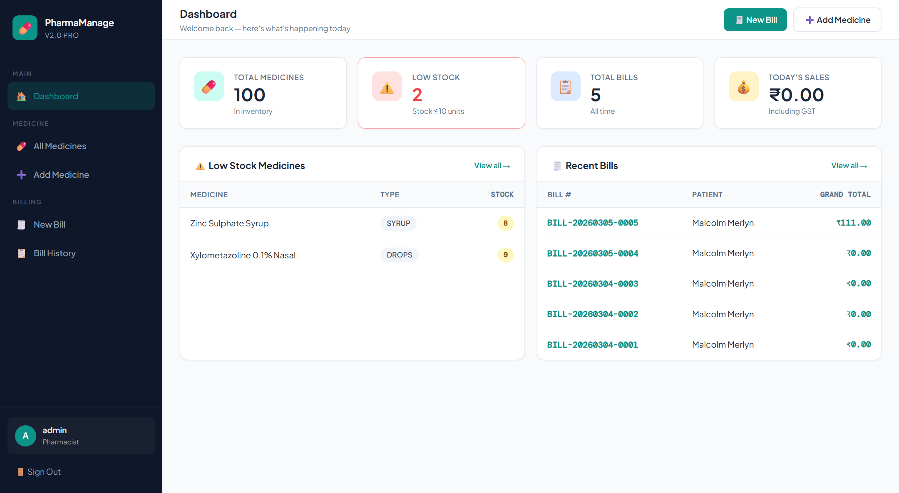
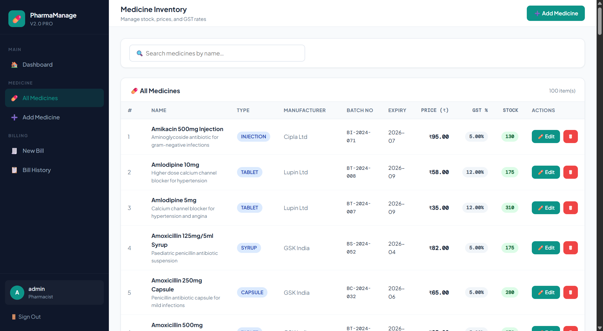
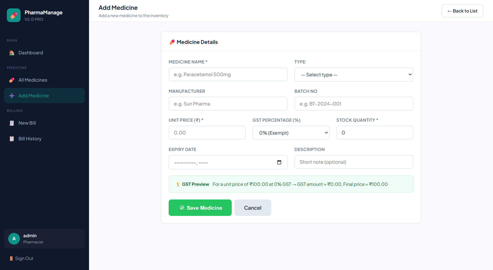
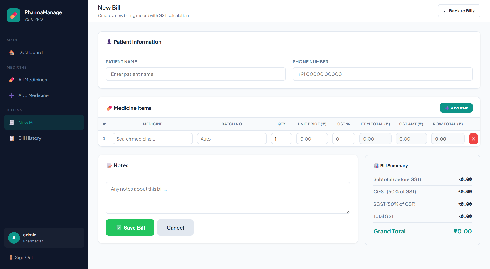
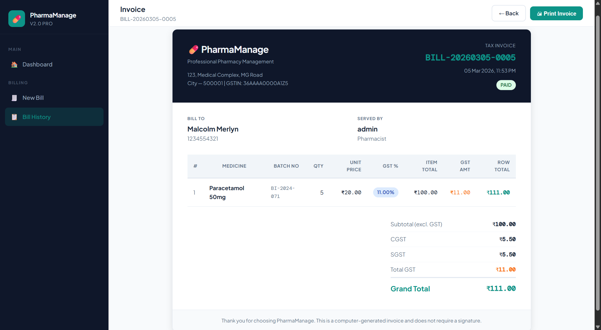

# 💊 Pharmacy Management System

## 📌 Project Overview

The **Pharmacy Management System** is a modern digital solution designed to streamline pharmacy operations and replace traditional manual registers.

The system helps pharmacies efficiently manage:

* Medicine inventory
* Billing and invoice generation
* Stock monitoring
* Staff management
* Pharmacy configuration

It is built using **Java, Spring Boot, HTML, CSS, JavaScript, and MySQL**, following a **clean MVC architecture** to ensure scalability and maintainability.

This repository serves as a **public showcase of the project features and architecture**.

⚠️ The **complete source code repository is private** to protect the intellectual property and implementation details.

If you are interested in using or purchasing this system, please contact the author.

---

# 🖥️ Application Interface

Below are some screenshots of the system interface to demonstrate the main modules and workflow.

### Dashboard



The dashboard provides a quick overview of pharmacy activity including:

* Total medicines in inventory
* Low stock alerts
* Recent billing activity
* Pharmacy statistics

It acts as the **central control panel for pharmacy operations**.

---

### Medicine Inventory



The inventory module displays all medicines stored in the system.

Each record contains:

* Medicine name
* Medicine type
* Manufacturer
* Batch number
* Expiry date
* Price and GST
* Stock quantity

This module allows pharmacy staff to **monitor stock availability and manage medicines efficiently**.

---

### Add Medicine



Pharmacy staff can add new medicines with detailed information such as:

* Manufacturer
* Batch number
* Expiry date
* Unit price
* GST percentage
* Available stock

This ensures **accurate tracking of medicines inside the pharmacy**.

---

### Smart Billing System



The billing module enables quick and accurate billing for customers.

Key capabilities include:

* Fast medicine search using autocomplete
* Adding multiple medicines in a single bill
* Automatic GST calculation
* Quantity-based pricing
* Real-time bill total calculation

This helps reduce manual work and speeds up the checkout process.

---

### Invoice Generation



Once billing is completed, the system generates a **clean printable invoice** containing:

* Pharmacy details
* Patient information
* Purchased medicines
* GST breakdown
* Grand total

Invoices can be printed or stored for future reference.

---

# 🚀 Core Features

## 💊 Medicine Management

The system provides a comprehensive medicine management module.

Capabilities include:

* Add new medicines
* Update medicine details
* Delete medicines
* Manage medicine categories
* Store manufacturer details
* Track batch numbers
* Maintain expiry dates
* Track medicine price and GST
* Manage stock quantities

This ensures the pharmacy inventory remains **organized and up-to-date**.

---

## 📦 Inventory Management

The inventory module automatically tracks stock levels.

Features include:

* Real-time stock updates
* Automatic stock deduction during billing
* Low stock detection
* Expiry monitoring
* Inventory visibility

This helps pharmacy staff avoid stock shortages and manage medicines efficiently.

---

## 🧾 Billing System

The billing system simplifies the medicine sales process.

Capabilities include:

* Create pharmacy bills
* Add multiple medicines per bill
* Automatic GST calculation
* Patient information support
* Invoice generation
* Bill history storage

The system automatically calculates:

* Item subtotal
* GST amount
* Total bill amount

---

## 👥 Staff Management

Pharmacy owners can manage staff access within the system.

Features include:

* Add staff members
* Assign roles
* Invite staff to join the pharmacy
* Manage staff permissions

Supported roles:

* Owner
* Pharmacist
* Staff

This ensures secure and organized pharmacy operations.

---

## 🏥 Multi-Pharmacy Support

The system supports **multi-tenant pharmacy architecture**, allowing multiple pharmacies to operate independently within the same system.

Each pharmacy has:

* Separate medicine inventory
* Independent billing records
* Dedicated staff
* Custom pharmacy settings

---

## ⚙️ Pharmacy Settings

The system allows configuration of pharmacy information including:

* Pharmacy name
* Address
* Contact information
* Billing information
* GST configuration

These settings automatically appear in generated invoices.

---

# 🔄 Application Working Flow

### 1️⃣ User Login

Pharmacy staff securely log into the system.

After authentication, the system redirects users to the dashboard.

---

### 2️⃣ Dashboard Overview

The dashboard provides an overview of:

* Inventory statistics
* Billing activity
* Alerts and notifications

---

### 3️⃣ Medicine Inventory Management

Staff can manage medicines by:

* Adding new medicines
* Updating stock
* Editing medicine details
* Monitoring expiry dates

All medicine data is stored in the database.

---

### 4️⃣ Billing Process

During a sale:

1. Staff opens the **New Billing page**
2. Medicines are searched using **autocomplete search**
3. Staff selects medicines and enters quantity
4. The system calculates price and GST automatically
5. The bill is stored in the database

---

### 5️⃣ Invoice Generation

Once billing is completed, the system generates a printable invoice containing:

* Pharmacy details
* Customer information
* Purchased medicines
* GST breakdown
* Grand total

---

### 6️⃣ Inventory Update

After billing:

* Medicine stock is automatically reduced
* Inventory data is updated
* Low stock alerts are triggered

---

# 🧠 System Architecture

The project follows the **MVC (Model – View – Controller)** architecture.

```
Client Browser
       ↓
Thymeleaf Templates (View)
       ↓
Spring Boot Controllers
       ↓
Service Layer
       ↓
Repository Layer
       ↓
MySQL Database
```

### Benefits

* Clean separation of concerns
* Maintainable code structure
* Scalable system design
* Easy feature expansion

---

# 🛠️ Technology Stack

### Backend

* Java
* Spring Boot
* Spring MVC
* Spring Data JPA

### Frontend

* HTML
* CSS
* JavaScript
* Thymeleaf

### Database

* MySQL

### Build Tool

* Maven

### Server

* Embedded Apache Tomcat

---

# 🔐 Security Features

* Session-based authentication
* Role-based access control
* Secure login system
* Input validation
* Controlled staff access

---

# 🔮 Future Improvements

Planned enhancements include:

* Barcode scanner integration
* Advanced sales reports
* Expiry alerts
* Low stock notifications
* PDF invoice export
* REST API support
* Android mobile application
* Cloud deployment

---

# 👨‍💻 Author

**Rezaul Karim Khan**

Software Engineer | Java | Spring Boot | Full Stack Development

🌐 Portfolio
https://rezaul.online

💻 GitHub
https://github.com/rezaul-code

🔗 LinkedIn
https://linkedin.com/in/rezaul-khan

---

# 💼 Commercial Availability

This system is available for **commercial licensing and custom deployment**.

If you are interested in purchasing or deploying the software for your pharmacy business, please contact the author.

---

# ⭐ Support

If you like the concept of this project, please **star the repository** ⭐
