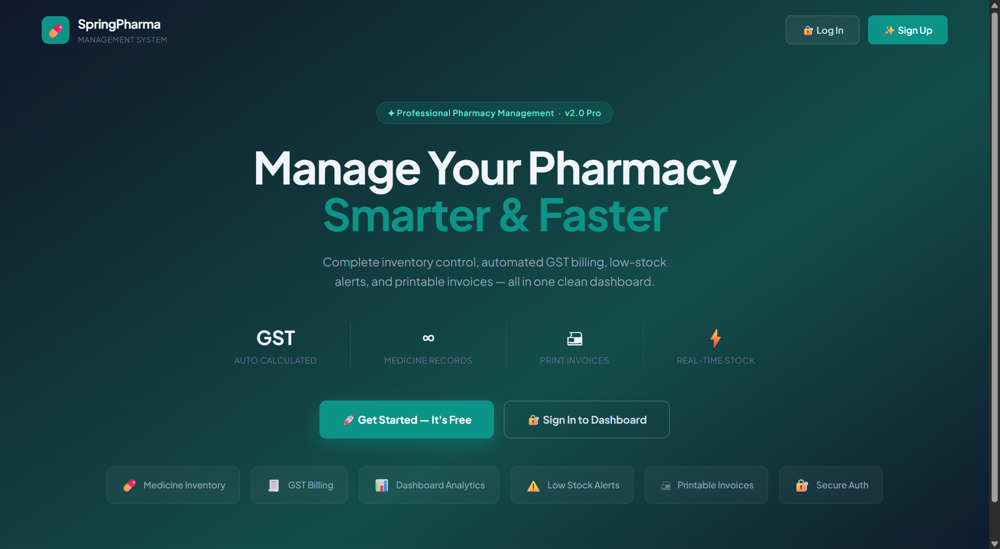
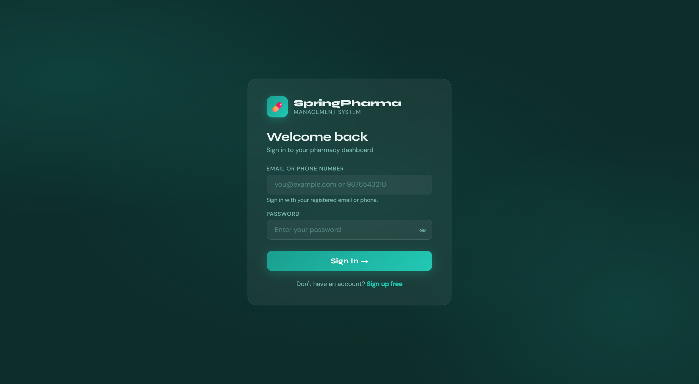
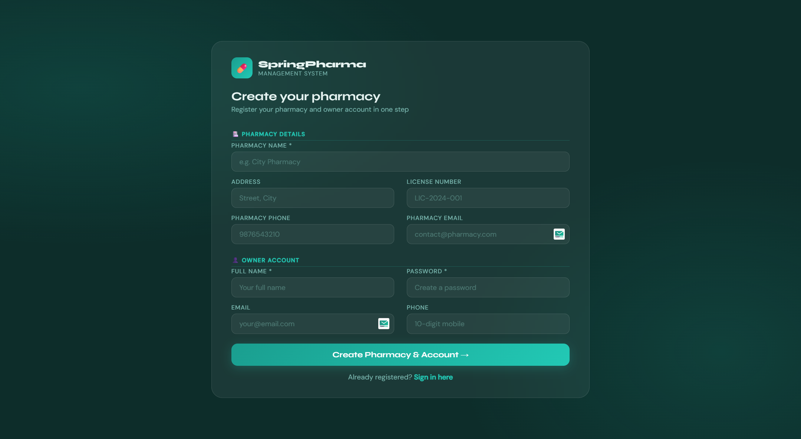
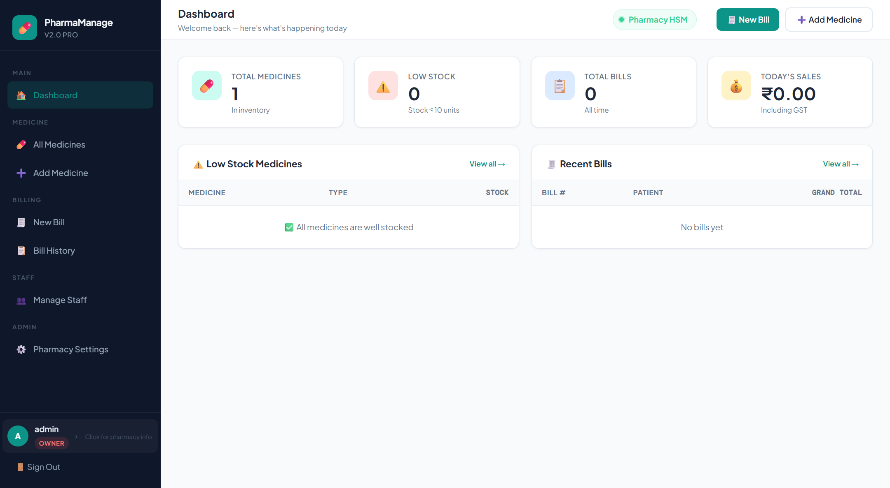
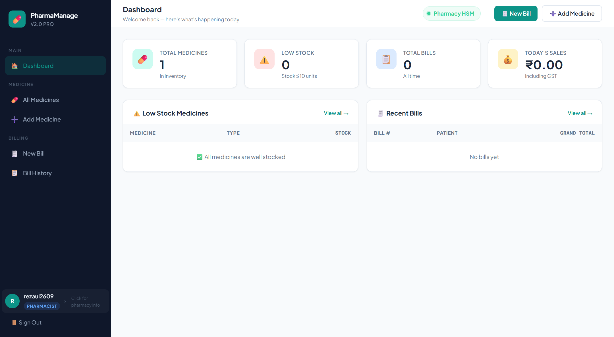
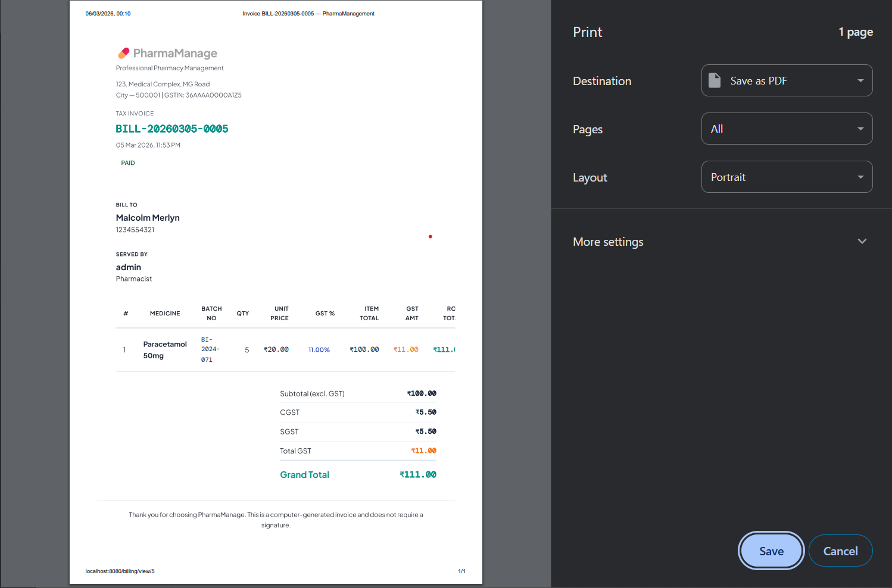

# 💊 Pharmacy Management System

## 📌 Project Overview

The **Pharmacy Management System** is a modern digital platform designed to simplify pharmacy operations and replace traditional manual registers.

It helps pharmacies efficiently manage:

* Medicine inventory
* Billing and invoice generation
* Stock monitoring
* Staff management
* Pharmacy configuration

The system is built using **Java, Spring Boot, HTML, CSS, JavaScript, and MySQL**, following a **clean MVC architecture** that ensures scalability and maintainability.

⚠️ **Important Notice**

This repository is a **public showcase repository** created to demonstrate the system features and workflow.

The **actual source code repository is private** to protect the intellectual property and original implementation.

If you are interested in using or purchasing this system, please contact the author.

---

# 🖥️ Application Interface

Below are some screenshots demonstrating the main modules and workflow of the system.

---

## 🏠 Home Page



The home page provides an introduction to the pharmacy system and allows users to navigate to login or registration pages.

---

## 🔐 Login System



The login system allows registered users to securely access the pharmacy system.

Features include:

* Secure authentication
* Session management
* Role-based access

---

## 📝 User Registration



New pharmacy users can create an account using the registration interface.

Once registered, users can log in and manage their pharmacy operations.

---

## 📊 Dashboard (Admin)



The admin dashboard provides a complete overview of the pharmacy system including:

* Total medicines
* Inventory overview
* Billing statistics
* System management tools

---

## 💊 Dashboard (Pharmacist)



The pharmacist dashboard focuses on operational tasks such as:

* Medicine inventory
* Billing system
* Stock monitoring
* Daily sales activities

---

## 💊 Add Medicine


Pharmacy staff can add new medicines with details such as:

* Manufacturer
* Batch number
* Expiry date
* Unit price
* GST percentage
* Available stock

This ensures accurate medicine tracking.

---

## 📦 Medicine Inventory


The inventory page shows all medicines stored in the pharmacy database.

Each medicine record includes:

* Medicine name
* Manufacturer
* Batch number
* Expiry date
* Price
* GST
* Available stock

This helps staff monitor stock levels and medicine availability.

---

## 🧾 Billing System


The billing module allows staff to quickly generate medicine bills.

Features include:

* Autocomplete medicine search
* Multiple medicines per bill
* Quantity-based billing
* Automatic GST calculation
* Real-time bill total

This helps pharmacies generate bills quickly and accurately.

---

## 🧾 Invoice Generation


Once a bill is generated, the system creates a clean invoice containing:

* Pharmacy information
* Patient details
* Purchased medicines
* GST breakdown
* Grand total

---

## 🖨️ Printable Invoice



The invoice can be printed directly for customers.

The layout is optimized for **clear and professional billing records**.

---

# 🚀 Core Features

## 💊 Medicine Management

The system provides a complete medicine management module.

Capabilities include:

* Add new medicines
* Edit medicine details
* Delete medicines
* Manage medicine categories
* Track manufacturers
* Maintain batch numbers
* Monitor expiry dates
* Track GST percentage
* Manage medicine pricing
* Maintain stock quantities

---

## 📦 Inventory Management

The inventory system automatically tracks stock levels.

Features include:

* Real-time stock updates
* Automatic stock deduction during billing
* Low stock alerts
* Expiry monitoring
* Prevent negative stock

---

## 🧾 Smart Billing System

The billing module simplifies pharmacy sales operations.

Capabilities include:

* Create pharmacy bills
* Add multiple medicines per bill
* Automatic GST calculation
* Patient information support
* Invoice generation
* Bill history tracking

---

## 👥 Staff Management

Pharmacy owners can manage staff within the system.

Features include:

* Add staff members
* Assign roles
* Staff login authentication
* Permission-based system access

Supported roles:

* Owner
* Pharmacist
* Staff

---

## 🏥 Multi-Pharmacy Support

The system supports **multi-tenant pharmacy architecture**.

Each pharmacy operates independently with:

* Separate medicine inventory
* Independent billing records
* Dedicated staff accounts
* Custom pharmacy configuration

---

## ⚙️ Pharmacy Settings

The system allows configuration of pharmacy information including:

* Pharmacy name
* Address
* Contact information
* GST configuration
* Billing information

These details automatically appear on invoices.

---

# 🔄 Application Working Flow

### 1️⃣ User Authentication

Users log into the system using the secure login interface.

---

### 2️⃣ Dashboard Access

After login, users are redirected to the dashboard where pharmacy activity can be monitored.

---

### 3️⃣ Medicine Management

Staff can add, edit, and manage medicines in the inventory.

---

### 4️⃣ Billing Process

When a customer purchases medicines:

1. Staff opens the **New Billing page**
2. Medicines are searched using **autocomplete**
3. Quantity is entered
4. The system calculates GST and totals automatically
5. The bill is saved in the database

---

### 5️⃣ Invoice Generation

The system generates a professional invoice including:

* Pharmacy details
* Customer details
* Medicine list
* GST breakdown
* Grand total

---

### 6️⃣ Inventory Update

After billing:

* Medicine stock is automatically reduced
* Inventory records are updated
* Low stock alerts are triggered if necessary

---

# 🧠 System Architecture

The project follows **MVC (Model – View – Controller)** architecture.

```
Client Browser
       ↓
HTML / Thymeleaf Templates (View)
       ↓
Spring Boot Controllers
       ↓
Service Layer
       ↓
Repository Layer
       ↓
MySQL Database
```

### Architecture Benefits

* Clean separation of concerns
* Maintainable codebase
* Modular structure
* Easy scalability

---

# 🛠️ Technology Stack

### Backend

* Java
* Spring Boot
* Spring MVC
* Spring Data JPA

### Frontend

* HTML
* CSS
* JavaScript
* Thymeleaf

### Database

* MySQL

### Build Tool

* Maven

### Server

* Embedded Apache Tomcat

---

# 🔐 Security Features

* Session-based authentication
* Role-based access control
* Secure login system
* Input validation
* Controlled staff access

---

# 💼 Commercial Availability

This software is available for **commercial licensing and deployment**.

If you are interested in purchasing or deploying this pharmacy system, please contact the author.

---

# 👨‍💻 Author

**Rezaul Karim Khan**

Software Engineer | Java | Spring Boot | Full Stack Development

🌐 Portfolio
https://rezaul.online

💻 GitHub
https://github.com/rezaul-code

🔗 LinkedIn
https://linkedin.com/in/rezaul-khan

---

# ⭐ Support

If you like the concept of this project, please **star the repository** ⭐
