# 💊 Pharmacy Management System

## 📌 Project Overview

The **Pharmacy Management System** is a modern digital platform designed to simplify pharmacy operations and replace traditional manual registers.

It helps pharmacies efficiently manage:

* Medicine inventory
* Billing and invoice generation
* Stock monitoring
* Staff management
* Pharmacy configuration
* Sales analytics and business insights

The system is built using **Java, Spring Boot, HTML, CSS, JavaScript, and MySQL**, following a **clean MVC architecture** that ensures scalability and maintainability.

⚠️ **Important Notice**

This repository is a **public showcase repository** created to demonstrate the system features and workflow.

The **actual source code repository is private** to protect the intellectual property and original implementation.

If you are interested in using or purchasing this system, please contact the author.

---

# 🖥️ Application Interface

Below are screenshots demonstrating the major modules of the system.

---

# 🏠 Home Page

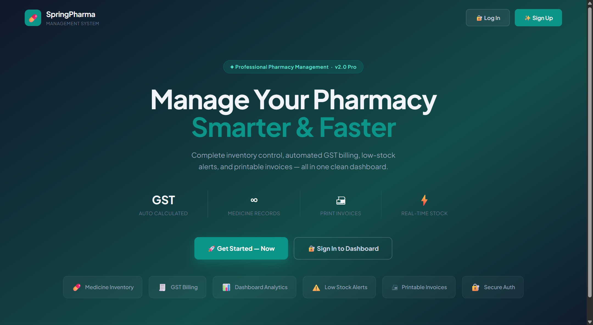

The home page introduces the system and provides navigation to login and registration pages.

---

# 🔐 Login System


Users can securely access the system using their credentials.

Features include:

* Secure authentication
* Session management
* Role-based access control

---

# 📝 User Registration


New pharmacies or users can register and create their account before accessing the system.

---

# 📊 Owner Dashboard

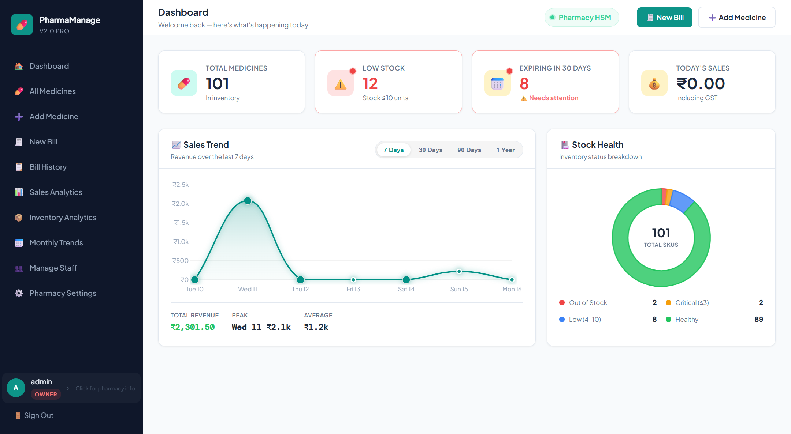

The dashboard provides a quick overview of pharmacy operations:

* Total medicines
* Inventory overview
* Sales analytics
* System management tools

---

# 💊 Add Medicine

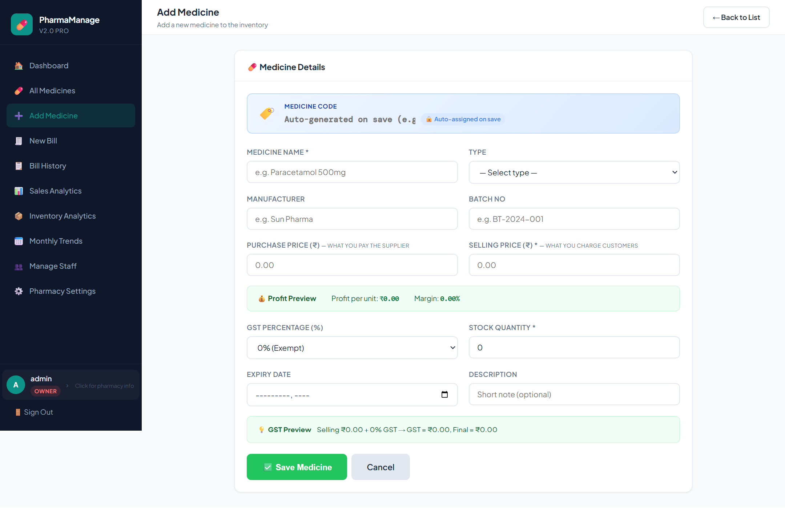

Pharmacy staff can add medicines with detailed information:

* Medicine name
* Manufacturer
* Batch number
* Expiry date
* Purchase price
* Selling price
* GST percentage
* Available stock

The system automatically generates a **unique medicine code**.

---

# 💊 Medicine Inventory

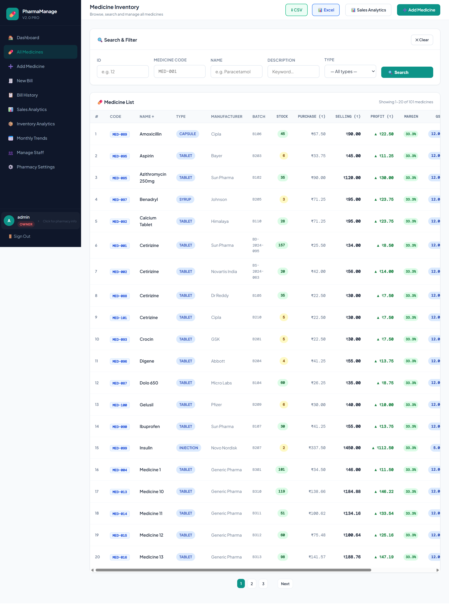

The inventory module displays all medicines stored in the pharmacy database.

Each medicine record contains:

* Medicine code
* Manufacturer
* Batch number
* Expiry date
* Purchase price
* Selling price
* GST percentage
* Stock quantity

---

# 🧾 Create New Bill

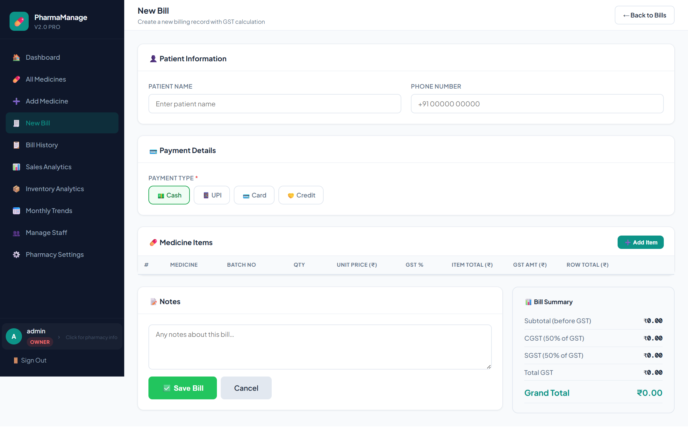

The billing module allows staff to generate bills quickly.

Features include:

* Medicine search
* Multiple medicine selection
* Quantity-based billing
* Automatic GST calculation
* Real-time bill total

---

# 📜 Bill History

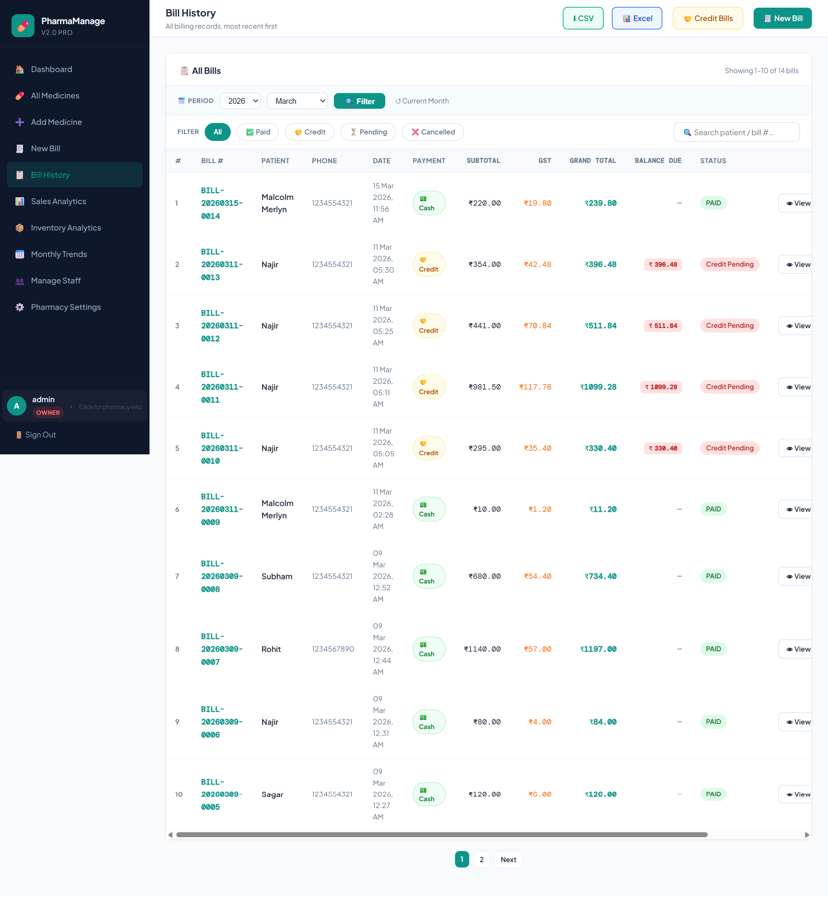

All generated bills are stored and can be accessed anytime for:

* Customer reference
* Record keeping
* Sales tracking

---

# 📊 Sales Analytics

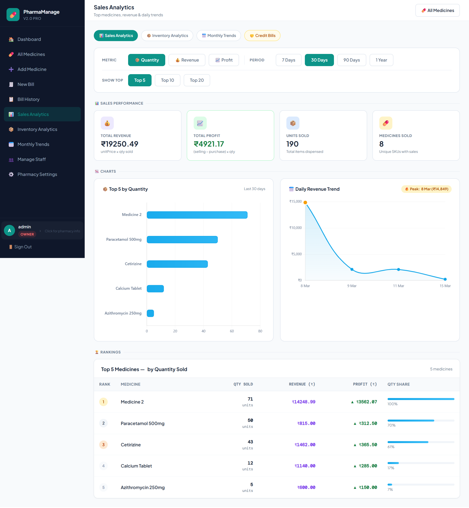

The analytics module provides insights into business performance.

Capabilities include:

* Revenue analytics
* Profit tracking
* Sales performance
* Business insights

---

# 📈 Monthly Sales Trends

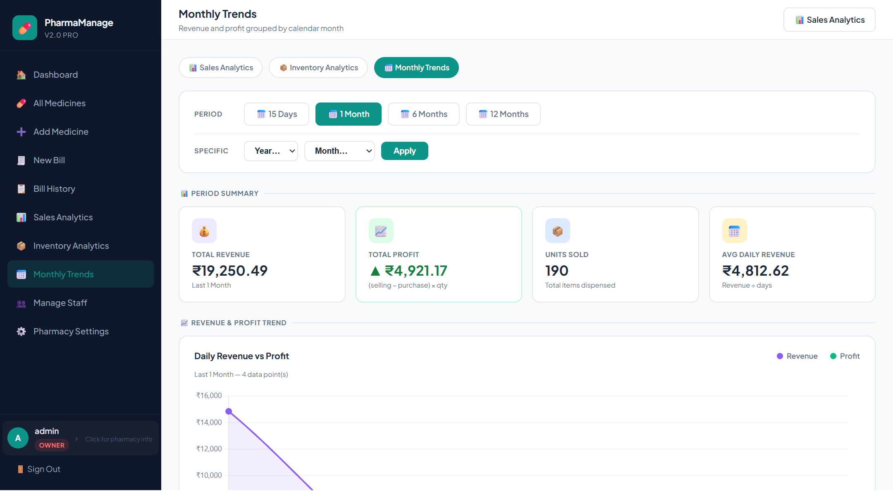

Monthly trend charts help pharmacy owners understand long-term sales performance.

---

# 📦 Inventory Analytics

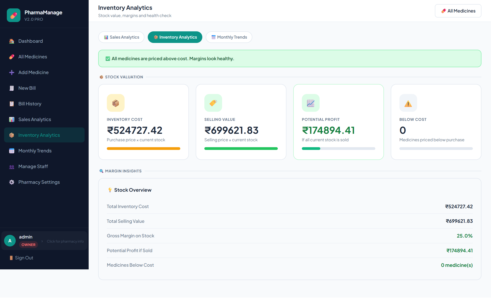

This module provides insights into:

* Inventory valuation
* Stock distribution
* Medicine availability

---

# 👥 Staff Management

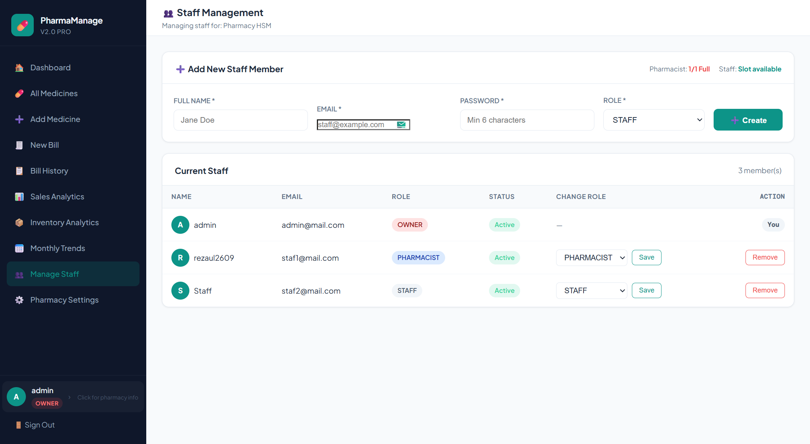

Pharmacy owners can manage staff members including:

* Add staff
* Assign roles
* Manage system access
* Staff authentication

Supported roles:

* Owner
* Pharmacist
* Staff

---

# ⚙️ Pharmacy Settings

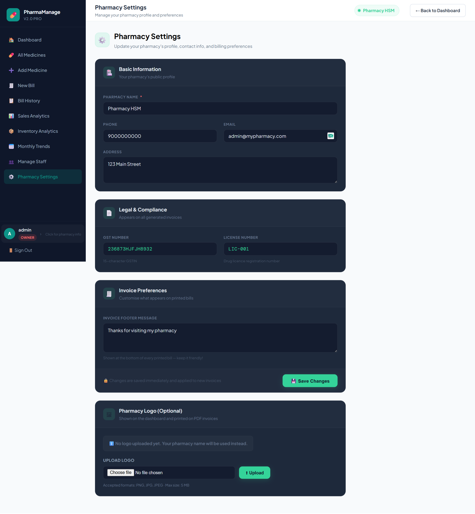

Pharmacy details can be configured including:

* Pharmacy name
* Address
* Contact information
* GST settings
* Billing information

These details automatically appear on invoices.

---

# 🚀 Core Features

## 💊 Medicine Management

* Add medicines
* Update medicine information
* Delete medicines
* Automatic medicine code generation
* Batch tracking
* Expiry tracking
* GST configuration
* Price management
* Stock quantity management

---

## 📦 Inventory Management

* Real-time stock tracking
* Automatic stock deduction during billing
* Low stock monitoring
* Expiry tracking
* Inventory valuation

---

## 🧾 Smart Billing System

* Create pharmacy bills
* Add multiple medicines per bill
* Automatic GST calculation
* Patient details support
* Bill history tracking
* Printable invoices

---

## 📊 Sales Analytics

* Revenue analytics
* Profit tracking
* Monthly sales trends
* Top selling medicines
* Inventory valuation

---

## 👥 Staff Management

* Staff account creation
* Role assignment
* Secure login
* Permission-based system access

---

# 🏥 Multi-Pharmacy Architecture

The system supports **multi-tenant pharmacy architecture**.

Each pharmacy operates independently with:

* Separate medicine inventory
* Independent billing records
* Dedicated staff accounts
* Custom pharmacy configuration

---

# 🔄 Application Workflow

```
User Login
     ↓
Dashboard Overview
     ↓
Medicine Inventory Management
     ↓
Add / Update Medicines
     ↓
Inventory Ready for Sale
     ↓
Create New Bill
     ↓
Select Medicines + Quantity
     ↓
Automatic GST Calculation
     ↓
Save Bill
     ↓
Inventory Updated
     ↓
Sales Data Stored
     ↓
Analytics Generated
```

Core lifecycle:

```
Inventory → Sales → Analytics
```

---

# 🧠 System Architecture

The project follows **MVC (Model – View – Controller)** architecture.

```
Client Browser
       ↓
Thymeleaf Templates (View)
       ↓
Spring Boot Controllers
       ↓
Service Layer
       ↓
Repository Layer
       ↓
MySQL Database
```

### Benefits

* Clean separation of concerns
* Scalable architecture
* Maintainable codebase
* Modular design

---

# 🛠️ Technology Stack

### Backend

* Java
* Spring Boot
* Spring MVC
* Spring Data JPA

### Frontend

* HTML
* CSS
* JavaScript
* Thymeleaf

### Database

* MySQL

### Build Tool

* Maven

### Server

* Embedded Apache Tomcat

---

# 🔐 Security Features

* Secure login system
* Role-based access control
* Session management
* Input validation
* Controlled staff access

---

# 💼 Commercial Availability

This system is available for **commercial licensing and deployment**.

For purchase or deployment inquiries, please contact the author.

---

# 👨‍💻 Author

**Rezaul Karim Khan**

Software Engineer | Java | Spring Boot | Full Stack Developer

🌐 Portfolio
https://rezaul.online

💻 GitHub
https://github.com/rezaul-code

🔗 LinkedIn
https://linkedin.com/in/rezaul-khan

---

# ⭐ Support

If you like this project, please **star the repository** ⭐
